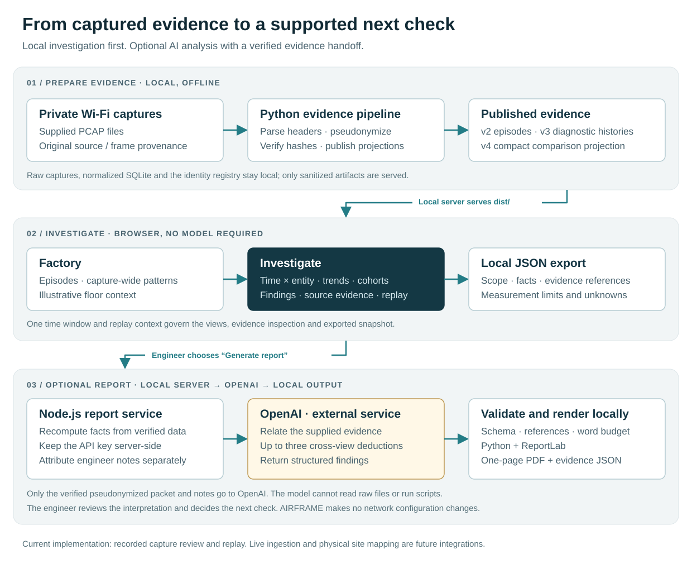

# AIRFRAME

**Turn factory Wi-Fi complaints into focused, evidence-backed investigations.**

A worker reports a disconnection. The network engineer needs to find what changed, who else experienced it, and what to check next. AIRFRAME brings recorded observations from multiple capture sources into one investigation, exposing relationships across time, access-point interfaces, channels and clients.

The engineer can investigate without AI. An optional incident report connects the evidence into a one-page assessment with supporting references, alternative explanations and next checks.

**Current scope:** a local prototype for historical capture review and recorded-data replay. Live monitoring, measured floor locations and automatic network changes are not implemented.

[Quick start](#quick-start) · [Architecture](#architecture) · [Workflow](#investigation-workflow) · [AI reports](#optional-ai-incident-reports) · [Development](#development-and-verification)

## What it helps answer

| Engineer's question | AIRFRAME view |
| --- | --- |
| Where and when does the behaviour concentrate? | A shared time window and a matrix grouped by AP interface, channel, client or capture source. |
| Is it local to one entity or shared across the network? | Pinned focus with other entities still visible, plus explicit peer comparisons. |
| Is something happening repeatedly? | Recurrence findings, interval evidence and client-level cadence. |
| Does a falling error count hide a different growing problem? | Reason transitions and aligned measurements over the same window. |
| Which clients differ, and where does progress stop? | Client cohorts, attempt sequences and observed connection stages. |
| What supports this conclusion, and what is missing? | Source/frame references, measurement coverage and visible evidence limits. |

These views remain explorable even when no automated finding is triggered. A finding is an observation to investigate, not a confirmed fault or an exhaustive anomaly detector.

## Quick start

**Requires Node.js 24 or later.** Run from the `airframe` directory:

```bash
npm start
```

Open [AIRFRAME locally](http://127.0.0.1:4173). Keep the server running while using the app. The checked-in `dist/` files are ready to serve; the core dashboard requires no dependency installation, asset build or API key.

- Start with **AF-104**, then select **Open investigation**.
- Use **Capture patterns** in Factory to enter a broader investigation.
- Choose **Replay capture** to step through recorded evidence.

To use another port:

```bash
PORT=4174 npm start
```

The server listens on `127.0.0.1` only. AI report generation additionally requires a server-side OpenAI credential, network access and Python with ReportLab.

## Architecture



### How the parts connect

1. **Prepare evidence offline.** Python reads the supplied captures, parses supported headers, assigns pseudonymous identifiers and retains source/frame provenance. The normalized SQLite store and identity registry stay local.
2. **Publish purpose-specific data.** The pipeline produces curated episodes, diagnostic histories and a compact comparison projection. Hashes bind the publications to their source data. The local Node.js server serves the browser app and sanitized artifacts from `dist/`.
3. **Compute the investigation locally.** Native browser JavaScript verifies the published data and computes measurements, comparisons and findings. One selection and replay context controls the views, evidence inspection and exports.
4. **Request a report when useful.** The browser submits the chosen scope and evidence snapshot. The server verifies local hashes and recomputes the analytical packet before calling OpenAI; browser-supplied measurements are not trusted as facts.
5. **Validate and deliver.** The server checks the structured response, fact references and word budget. Python renders a one-page PDF; companion JSON preserves the canonical evidence and report provenance.

| Layer | Implementation | Responsibility |
| --- | --- | --- |
| Offline preparation | Python, SQLite | Capture parsing, aliases, evidence publications and integrity hashes. |
| Application shell | HTML, CSS, native JavaScript modules | Factory, Investigate, navigation, replay and evidence dialogs. |
| Evidence services | `service.js`, `diagnostic-service.js`, `clue-service.js` | Scoped retrieval, measurements, comparisons, findings and analysis packets. |
| Local server | Node.js built-in HTTP server | Static delivery, loopback access checks and report endpoints. |
| Optional inference | OpenAI Responses API | Relationships and next checks derived from supplied evidence. |
| Report output | Validation, Python + ReportLab | One-page PDF and traceable JSON snapshot. |

**The browser and report server reuse the same comparison service.** The report follows the same selection and evidence rules as the dashboard. The model has no direct access to raw PCAPs, credentials or a shell.

## Investigation workflow

### 1. Factory — choose where to begin

- Open a curated episode or a capture-wide pattern.
- See the selected case, capture sources and recorded interval.
- Use the floor illustration for context; AP placements are estimated, not measured locations or a live health map.

### 2. Investigate — assemble the clues

- Set one recorded-time window and pivot between interfaces, channels, clients and sensors.
- Compare termination observations, association responses, retry-marked share, EAP and protected-data observations.
- Examine aligned trends, reason changes, peer comparisons, client cohorts and connection progression.
- Select a cell, finding or client to inspect supporting observations and source references.
- Keep broader context visible while focusing on a particular entity.

### 3. Incident report — share the supported relationships

Inside **Investigate**, open **Incident report** to inspect or export local JSON, add optional floor context, or explicitly request AI analysis. The one-page report contains up to three deductions with evidence, rationale, limits and discriminating next checks. Engineer notes remain separately attributed context.

### Historical review and capture replay

| Mode | Behaviour |
| --- | --- |
| Historical review | Uses the available evidence from the completed capture. |
| Capture replay | Releases observations up to the selected recorded-time cutoff. Seeking backward removes later evidence from views and newly exported packets. |

Replay demonstrates how an investigation develops over recorded time; it is not a live feed. Completed reports remain snapshots of their original scope.

## Optional AI incident reports

The dashboard and local JSON export work without an API key.

For report generation, install **Python 3 with `reportlab`** in your chosen Python environment. Supply `OPENAI_API_KEY` through the server process environment, or create an ignored `.env.server` file pointing to an existing private dotenv file:

```dotenv
AIRFRAME_OPENAI_ENV_FILE=/absolute/path/to/private.env
AIRFRAME_PYTHON=/absolute/path/to/python3
```

Replace the example paths with your own. The referenced credential file supplies `OPENAI_API_KEY` and optionally `OPENAI_MODEL`. A key placed directly in `.env.server` is not read by the current loader.

| Setting | Purpose |
| --- | --- |
| `OPENAI_API_KEY` | Server process credential; takes precedence over the referenced file. |
| `AIRFRAME_OPENAI_ENV_FILE` | Private credential file path; accepted in the process environment or `.env.server`. |
| `AIRFRAME_OPENAI_MODEL` | Model override in the process environment or `.env.server`; otherwise uses the credential file's `OPENAI_MODEL`, then the service default. |
| `AIRFRAME_PYTHON` | Interpreter with ReportLab installed; defaults to `python3`. |
| `PORT` | Local server port; defaults to `4173`. |

Restart the server after changing its process environment. File-based report configuration is read for each request.

- Only **Generate incident report** sends the verified pseudonymized packet and engineer notes to OpenAI. Local JSON preparation/export does not.
- API keys stay on the server. The report service does not execute model-generated code.
- Unknown fact references, invalid responses and PDF overflow fail explicitly. There is no fabricated report fallback.
- Reference validation checks cited IDs; it does not prove every natural-language interpretation. An engineer reviews the report.
- Generated PDF and JSON files are stored locally in ignored `output/pdf/`.

See [report integration and connection troubleshooting](docs/INCIDENT_REPORT_API.md) for API details, configuration precedence and failure handling.

## Data and interpretation boundaries

The supplied dataset contains **8 captures and 1,118,853 records**. The full normalized store remains local; the browser uses narrower publications:

| Publication | Contents |
| --- | --- |
| `dist/data-v2/` | Three curated episode windows, base manifest and integrity metadata. |
| `dist/data-v3/` | Client histories, capture patterns, security metadata and lazy evidence/quality partitions. |
| `dist/data-v4/` | Compact comparison projection containing 187,163 unique original frame observations from the published histories. |

The compact projection is not the complete capture. Deduplication keeps each original source/frame once across overlapping client histories; it does not establish that separate sensors captured the same over-air transmission.

- An **AP interface / BSSID** is not a verified physical AP inventory item.
- Observation counts are not fault rates or unique incident counts; retry-marked share is not packet loss.
- Successful association is not completed enterprise authentication or application recovery.
- No observation, a computed zero and an unavailable measurement are different states.
- Reason codes describe protocol outcomes, not a proven microwave, movement, firmware or AAA cause.
- Unverified source clocks, capture gaps and PHY metadata limit physical timing and RF conclusions.
- Raw captures, identity mappings, application payloads and EAP identity text are excluded from published evidence.

## Development and verification

Run the service, parser, static and report checks. Python 3 is required for the parser checks; `AIRFRAME_PYTHON` can select the interpreter.

```bash
npm test
```

With the local server running, run the investigation browser suite:

```bash
npm run test:ui
```

Browser tests need the `playwright` package and Chrome. Set `AIRFRAME_TEST_URL` or `AIRFRAME_BROWSER_CHANNEL` to override the default URL or browser channel. Results and screenshots are written to ignored `test-results/clue-workspace/`.

`npm run test:ui:legacy` retains earlier browser checks. Its older investigation selectors target the replaced screen; use the current suite for the active workflow. Executed verification records and limitations are linked below.

### Rebuild the supplied evidence

Normal use does not require a rebuild. To reproduce the publications, provide the original files at `data/raw/sensor01.pcap` through `sensor08.pcap`, with Python and Node.js available, then run from this directory:

```bash
python3 scripts/build_evidence.py
python3 scripts/build_diagnostics.py
python3 scripts/build_clue_data.py
```

Run these in order: the first produces the local store, identity registry and base bundle; the second publishes expanded diagnostics; the third builds the comparison projection and integrity anchor. They verify expected inputs and regenerate derived files without modifying the captures.

These builders target the supplied, hash-identified dataset. Supporting another capture requires an ingestion/admission workflow and a new trusted integrity anchor; there is no general-purpose PCAP upload screen today.

## From prototype to a shop-floor pilot

| Available now | Needed for live operation |
| --- | --- |
| Engineer-led review of the supplied recorded captures. | Live capture/controller/AAA ingestion and continuous data validation. |
| Shared-time comparisons, replay, inspectable findings and optional reports. | Verified site inventory, physical mapping, source health and clock alignment. |
| A loopback server and locally stored report artifacts. | Authentication, per-user authorization, deployment, retention and operational monitoring. |

A supervised pilot can evaluate **time to a supported next check** and the quality of evidence handoffs. Investigation-time savings and production-downtime reduction have not been measured. AIRFRAME does not change network configuration automatically.

## Repository map

```text
airframe/
├── dist/                       Browser app and published evidence
│   ├── index.html, styles.css  Application shell and styling
│   ├── js/                     UI modules and shared evidence services
│   ├── data-v2/                Curated episodes and base manifest
│   ├── data-v3/                Expanded diagnostic publications
│   └── data-v4/                Compact comparison projection
├── scripts/                    Offline builders, local server and report renderer
├── tests/                      Service, parser, report and browser checks
├── docs/                       Architecture, contracts and verification records
├── data/                       Private captures, identity registry and SQLite (ignored)
├── output/pdf/                 Generated incident reports (ignored)
├── package.json                Run and verification commands
└── README.md
```

Key entry points: [application and replay](dist/js/app.js), [Factory](dist/js/factory.js), [Investigate](dist/js/clue-workspace.js), [comparison service](dist/js/clue-service.js), [local server](scripts/serve.mjs), [report generation](scripts/incident-report.mjs). The retained `action.js` and `investigation.js` modules are legacy; the current navigation is **Factory → Investigate**, with reporting inside Investigate.

## Further documentation

- [Investigation workspace product contract](docs/CLUE_WORKSPACE_PRODUCT.md)
- [Comparison service, integrity and analysis packet API](docs/CLUE_SERVICE_API.md)
- [Incident report product requirements](docs/INCIDENT_REPORT_PRODUCT.md)
- [Incident report integration and troubleshooting](docs/INCIDENT_REPORT_API.md)
- [Investigation verification](docs/CLUE_WORKSPACE_VERIFICATION.md) and [report verification](docs/INCIDENT_REPORT_VERIFICATION.md)
- [Diagnostic data reconciliation](docs/DIAGNOSTIC_DATA_RECONCILIATION.md)
- [Original contract](contract.md), [implementation interface](docs/implementation-interface.md) and [build decisions](docs/BUILD_DECISIONS.md)

Some earlier contracts describe the original three-screen design. This README describes the current two-screen navigation and optional report flow.
